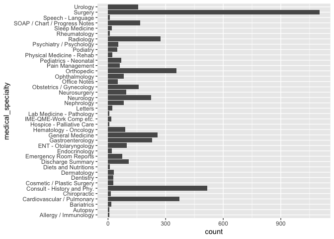

LAB6
================

``` r
fn<-"mtsamples.csv"
if (!file.exists(fn))
  download.file("https://raw.githubusercontent.com/USCbiostats/data-science-data/master/00_mtsamples/mtsamples.csv",
    destfile = fn
    )

mtsamples<-read.csv(fn)
mtsamples<-as.tibble(mtsamples)
```

    ## Warning: `as.tibble()` was deprecated in tibble 2.0.0.
    ## Please use `as_tibble()` instead.
    ## The signature and semantics have changed, see `?as_tibble`.

``` r
head(mtsamples)
```

    ## # A tibble: 6 × 6
    ##       X description    medical_specialty sample_name  transcription   keywords  
    ##   <int> <chr>          <chr>             <chr>        <chr>           <chr>     
    ## 1     0 " A 23-year-o… " Allergy / Immu… " Allergic … "SUBJECTIVE:, … "allergy …
    ## 2     1 " Consult for… " Bariatrics"     " Laparosco… "PAST MEDICAL … "bariatri…
    ## 3     2 " Consult for… " Bariatrics"     " Laparosco… "HISTORY OF PR… "bariatri…
    ## 4     3 " 2-D M-Mode.… " Cardiovascular… " 2-D Echoc… "2-D M-MODE: ,… "cardiova…
    ## 5     4 " 2-D Echocar… " Cardiovascular… " 2-D Echoc… "1.  The left … "cardiova…
    ## 6     5 " Morbid obes… " Bariatrics"     " Laparosco… "PREOPERATIVE … "bariatri…

## Question 1: How many and how are specialties

``` r
specialties<-mtsamples %>%
  count(medical_specialty)

specialties %>%
  arrange(desc(n))%>%
  top_n(15)%>%
  knitr::kable()
```

    ## Selecting by n

| medical\_specialty            |    n |
|:------------------------------|-----:|
| Surgery                       | 1103 |
| Consult - History and Phy.    |  516 |
| Cardiovascular / Pulmonary    |  372 |
| Orthopedic                    |  355 |
| Radiology                     |  273 |
| General Medicine              |  259 |
| Gastroenterology              |  230 |
| Neurology                     |  223 |
| SOAP / Chart / Progress Notes |  166 |
| Obstetrics / Gynecology       |  160 |
| Urology                       |  158 |
| Discharge Summary             |  108 |
| ENT - Otolaryngology          |   98 |
| Neurosurgery                  |   94 |
| Hematology - Oncology         |   90 |

``` r
# Method 1: Not that pretty
ggplot(mtsamples, aes(x=medical_specialty))+
      geom_histogram(stat="count")+
      coord_flip()
```

    ## Warning: Ignoring unknown parameters: binwidth, bins, pad

<!-- -->

``` r
# Method 2:
ggplot(specialties, aes(x=n, y=fct_reorder(medical_specialty,n)))+
  geom_col()
```

<!-- --> \# Question 2:

``` r
mtsamples %>%
  unnest_tokens(output=word, input=transcription) %>%
  count(word, sort = TRUE) %>%
  top_n(20) %>%
  ggplot(aes(x=n, y=fct_reorder(word, n))) +
  geom_col()
```

    ## Selecting by n

<!-- --> \#\# Note that
“patient” seems important.

# Question 3:

``` r
mtsamples %>%
  unnest_tokens(output=word, input=transcription) %>%
  count(word, sort = TRUE) %>%  
  anti_join(stop_words, by="word")%>%
  # Using regular expression to remove numbers
  filter(!grepl("^[0-9]+$", x= word))%>%
  top_n(20) %>%
  ggplot(aes(x=n, y=fct_reorder(word, n))) +
  geom_col()
```

    ## Selecting by n

<!-- -->

``` r
# Looking better, but we don't like numbers.
```

# Question 4: Repeat question 2, but this time tokenize into bi-grams. how does the result change if you look at tri-grams?

``` r
# Bigram
mtsamples %>%
  unnest_ngrams(output=bigram, input=transcription,n=2) %>%
  count(bigram, sort = TRUE) %>%
  top_n(20) %>%
  ggplot(aes(x=n, y=fct_reorder(bigram, n))) +
  geom_col()
```

    ## Selecting by n

<!-- -->

``` r
#Trigram
mtsamples %>%
  unnest_ngrams(output=trigram, input=transcription,n=3) %>%
  count(trigram, sort = TRUE) %>%
  top_n(20) %>%
  ggplot(aes(x=n, y=fct_reorder(trigram, n))) +
  geom_col()
```

    ## Selecting by n

<!-- --> Now some
phrases start to show up like “tolerated the procedure”

# Question 5:

``` r
bigrams <-mtsamples %>%
  unnest_ngrams(output=bigram, input=transcription,n=2) %>%
  separate(bigram,into =c("w1","w2"),sep="")
  
bigrams %>% 
  filter(w1=="there")%>%
  select(w1,w2)%>%
  count(w2, sort =TRUE)
```

    ## # A tibble: 0 × 2
    ## # … with 2 variables: w2 <chr>, n <int>

``` r
bigrams %>% 
  filter(w1=="there")%>%
  select(w1,w2)%>%
  count(w1, sort =TRUE)
```

    ## # A tibble: 0 × 2
    ## # … with 2 variables: w1 <chr>, n <int>
